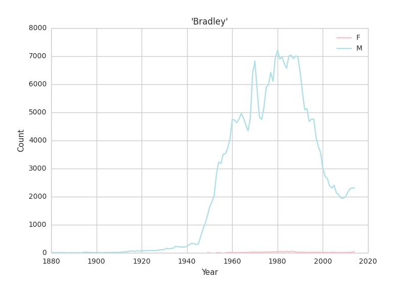

## Explore US baby names

The US government releases name counts for Social Security number applicants [details](https://www.ssa.gov/oact/babynames/background.html). These data track the distribution of baby names in the US. Data from 1880-2014 are available for [download as SQLite database](https://www.kaggle.com/kaggle/us-baby-names/downloads/database.sqlite.zip).

Functions here in R and Python take a (case-insensitive) name string as input and return counts for the name over time separately for males and females. A data frame and plot of the name by year is returned. e.g. for my name:

```python
df = namePlt("bradley")
```



